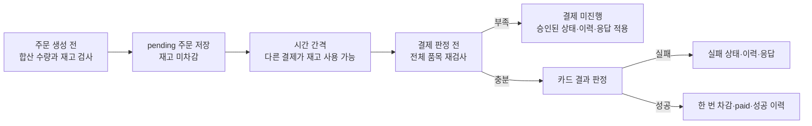

# 12강 스피커 노트 — 다중 파일 변경: 계획에서 diff 확인까지

Part 2 · Chapter 3 · 12강 · 실습 · 약 45분 · **슬라이드 없음** — Lab README와 Codex를 split 화면으로

Chapter 3의 시작이다. Chapter 2에서 준비한 Issue·정책·plan template·self-review prompt를
**처음으로 실제 코드 변경에 사용한다.** 이번 Lab의 중심은 재고 코드를 고치는 것이 아니라
**여러 파일이 함께 바뀌는 변경을 승인 가능한 작은 단계로 나누고 실제 diff·검증과 대조하는 것**이다.

실습 네 개 — 근거 연결(E1) · 단계와 승인(E2) · 구현과 diff 대조(E3) · 범위 판단과 마무리(E4).

## 이 노트 쓰는 법

- 5·6·11강과 같은 방식이다. 왼쪽에 Lab README·계획·diff, 오른쪽에 Codex.
  `[@파일]`은 mention, `[…]`는 화면 조작이다. 인용부호 안은 그대로 읽어도 되는 말이다.
  ⚠️는 놓치면 뒤가 어긋나는 지점.
- 각 실습은 **문제 제기 → 개념·자료 → 데모 → 결과 판단 → 다음 단계 연결** 순서로 진행한다.
  **README를 낭독하거나 Codex 답변의 모든 항목을 읽지 않는다.**
- ⚠️ **학생용 README에는 실행 순서와 판정 기준만 남겼다.** 여기서 뺀 **연결 고리 표 · 재고 검사 시점
  도식 · 검증 수단과 한계 표**는 이 노트의 **강사용 자료**다. 학생에게 다시 읽게 하지 말고 강사가
  화면에서 **대표 항목만** 짚는다.
- ⚠️ **문장이나 파일 순서가 매번 같다고 가정하지 않는다.** 화면에 나온 결과에서 **목표·근거·범위·검증·
  승인 경계**를 짚는다. **성공·실패를 확인하기 전에는 완료했다고 말하지 않는다.**
  각 실습 끝의 **「결과에 따른 분기」는 실제 결과에 맞는 것만** 고른다.
- 화면 안내는 **README 제목과 표 이름**으로 찾는다. 생성 결과의 줄 번호·특정 finding·구현 순서는
  고정하지 않는다.
- 기준 자료: `labs/lecture12/README.md` · `labs/lecture12/inputs/l12-issue.md`
  (리허설 저장소는 `~/Documents/코덱스강의/order-ops-demo`).

## 시작 상태 (강사가 미리 확인)

- Lab 11 산출물이 있다 — `notes/session-handoff.md`, 최종화된 `AGENTS.md`, 세 정책,
  `docs/templates/implementation-plan.md`, `docs/prompts/self-review.md`.
- `src/`·`tests/`는 v0이며 **diff·staged diff·untracked 모두 비어 있다.**
- 시작 시 아래를 기록해 둔다. **E2·E4에서 이 값과 대조한다.**
  ```bash
  git branch --show-current
  git log --oneline -3
  git log --oneline -3 -- src tests
  git status --short --untracked-files=all
  git diff --stat -- src tests
  git diff --cached --stat -- src tests
  ```
  ⚠️ **HEAD 해시 하나만 적지 않는다.** 실습 자료를 개정하면 HEAD는 계속 움직이므로,
  **최근 커밋 몇 개와 「그중 `src`·`tests`를 건드린 커밋이 있는지」**를 함께 본다.
- ⚠️ **구현에 필요한 미결이 남아 있으면 E2에서 승인하지 않는다.** 수업 진행을 위해 미결을 승인한
  것처럼 바꾸지 않는다.

---

# 여는 말 — 이제 기준을 실제 코드에 사용한다 (약 2분)

`[화면: README 도입부 → 2절 흐름도 → 이번 Issue → 현재 Git 상태]`

## 중심 질문

> "지금까지는 **코드를 고치기 전에 필요한 기준을 준비**했습니다. 이번 강의부터 그 기준을 **실제 코드
> 변경에** 써봅니다."

> "예제는 **결제에 성공한 뒤에만 재고를 줄이는** 작업입니다. 다만 **오늘의 핵심은 재고 코드를 얼마나
> 빨리 고치느냐가 아닙니다.** 여러 파일이 바뀌는 작업을 **사람이 확인할 수 있게 나누는 것**입니다."

## 전체 흐름도 — 가리킬 칸과 할 말

`[화면: README 2절의 흐름도]` **네 박자로 짚는다** — ① 큰 줄기 한 번 → ② 마름모 세 개 →
③ 되돌아오는 화살표 두 개 → ④ 멈춤 칸. **박스를 다 읽지 않는다.** 아래 굵은 글씨가 **가리킬 칸 이름**이다.

### ① 큰 줄기를 위에서 아래로 한 번 (손가락을 멈추지 말고 훑는다)

**맨 위 `handoff・이번 Issue・정책`**
> "여기서 시작합니다. **지난 시간에 넘긴 인계 문서, 이번 Issue, 그리고 정책 문서.** 셋 다 오늘 새로
> 만드는 게 아니라 **이미 있는 것**이죠."

**바로 아래 `E1 근거와 변경 후보 연결`**
> "첫 번째 실습은 그 셋을 **연결**합니다. **무엇을 왜 바꿀지**를 계획의 앞부분에 옮겨요."

**그다음 `E2 Steps・검증・경계 계획`**
> "두 번째는 **어떤 순서로 바꾸고 무엇으로 확인할지**를 채웁니다."

**`승인` 화살표를 타고 `E3 한 Step 구현・검증・diff 대조`**
> "승인이 나면 **한 단계씩 구현하고, 바로 검증하고, 실제 diff를 계획과 맞춰 봅니다.**"

**오른쪽 아래 `E3 읽기 전용 self-review` → `E4 Scope guard 판단・최종 검증・기록・staged diff 확인`**
> "단계를 다 끝내면 **읽기 전용으로 한 번 더 검토**하고, 마지막에 **범위를 판단하고 검증 기록을
> 남깁니다.**"

**맨 아래 `완료 커밋・Self-check・Lab 13 기준선`**
> "여기까지 오면 커밋하고, 이 상태가 **다음 강의의 기준선**이 됩니다."

> "이게 정상 흐름입니다. **E1 → E2 → E3 → E4.** 그런데 이 그림에서 진짜 봐야 할 건 **직선이 아니라
> 나머지**예요."

### ② 마름모 세 개 — 오늘 사람이 판단하는 자리

⚠️ **마름모만 손으로 세 번 찍는다.** "하나, 둘, 셋."

**첫 번째 마름모 `사람 구현 승인`**
> "**계획을 잘 썼다고 바로 코드를 바꾸는 게 아닙니다.** 여기서 사람이 **필요한 결정이 다 됐는지,
> 범위가 뭔지** 확인한 뒤에야 내려갑니다."

**두 번째 마름모 `승인 범위 안인가?`**
> "구현하는 **중간마다** 묻습니다. 한 번에 다 만들고 마지막에 확인하는 게 아니라, **한 단계 끝날
> 때마다** 승인한 범위 안인지 봅니다."

**세 번째 마름모 `차단 문제가 해결됐는가?`**
> "마지막입니다. **여기서 아니오면 커밋하지 않습니다.**"

> "**세 곳 다 사람이 판단합니다.** 오늘 실습의 뼈대가 이 세 개예요."

### ③ 되돌아오는 화살표 두 개 — 계획대로만 가지 않는다

⚠️ **손가락으로 화살표를 거꾸로 따라간다.** 이게 이 그림의 핵심이다.

**`승인 범위 안인가?`에서 `예・다음 Step 있음`으로 다시 `E3`로 올라가는 화살표**
> "먼저 이 화살표. **범위 안이고 남은 단계가 있으면 다시 구현으로 돌아옵니다.** 구현·검증·대조를
> **단계 수만큼 반복**한다는 뜻이에요."

**`E4 범위 판단…`에서 `계속하기로 승인`으로 `E2`까지 거슬러 올라가는 화살표**
> "그리고 이게 더 중요한 화살표입니다. **범위를 벗어났을 때 어디로 가는지 보세요 — 계획으로 돌아갑니다.**"
> "구현하다가 예상 밖 변경이 생기면 **그냥 밀고 나가는 게 아니라, 계획을 고치고 다시 승인받고** 내려옵니다."

> "그러니까 **E1부터 E4까지 번호가 있다고 무조건 끝까지 밀어붙이는 게 아닙니다.** E3에서 범위가 커졌다면
> **E4의 판단 기준을 먼저** 적용해요."

### ④ 멈춤 칸 — 세 곳에서 모인다

**오른쪽의 `멈춤・필요한 사람 결정 확인`을 가리키고, 들어오는 화살표 세 개를 하나씩 따라간다**
> "마지막으로 이 칸을 보세요. **들어오는 화살표가 셋**입니다."
> "**승인 단계에서** 미결이 남았을 때, **범위 판단에서** 결정을 보류할 때, **마지막에** 차단 문제가
> 안 풀렸을 때 — **전부 여기로 옵니다.**"

⚠️ **멈춤의 의미를 못 박는다.**
> "**멈춤은 실패 칸이 아닙니다.** 그림에서 가장 많은 화살표를 받는 칸이에요. **사람의 결정이 필요하다는
> 걸 정상적으로 발견한 자리**입니다."

### 오늘의 질문

⚠️ **여기서 흐름도를 닫고 Issue로 넘어간다.**
> "그래서 이 강의의 질문은 **'AI가 코드를 만들 수 있나?'보다 '어떤 근거로 시작을 허용하고, 어떤 증거로
> 결과를 받아들일까?'**입니다. 오늘 만든 계획과 검토 기록이 그 질문에 답해야 합니다."

## 현재 코드와 시작 상태

`[화면: README 2절의 현재 코드·목표 대조표]`
> "현재는 **주문을 만들 때 재고가 줄고, 결제 실패 시 주문이 삭제**됩니다. 이번 목표는 그 동작을
> **승인된 기준에 맞추는** 겁니다."

⚠️ **여기서 한 문장을 남긴다.**
> "**현재 이렇게 구현돼 있다는 사실이 곧 그렇게 동작해야 한다는 근거는 아닙니다.**"

> "시작 전에 **현재 브랜치와 변경 파일**부터 확인하겠습니다. 이미 있던 변경을 이번 작업의 결과로
> 착각하거나 덮어쓰면 안 되니까요. 이전 인계 문서의 미결 항목도 가져오되, **이전 검증용 계획을 이번
> 구현의 승인 계획으로 쓰지는 않습니다.**"

`[터미널 — 한 번에 붙여 넣고, 출력을 위에서부터 짚는다]`
```bash
git branch --show-current
git log --oneline -3
git status --short --untracked-files=all
git diff --stat -- src tests
git diff --cached --stat -- src tests
```

⚠️ **출력을 짚으며 무엇을 보는지 말한다.** 명령을 다섯 개 읽는 게 아니라 **세 가지를 확인**한다.

**첫째·둘째 — `branch`와 `log --oneline -3`**
> "지금 **어느 브랜치의 어느 커밋에서 출발하는지**입니다. 해시 하나만 보면 **인계 문서와 다를 때 왜
> 달라졌는지 알 수가 없어요.** 그래서 **최근 커밋 세 개**를 같이 봅니다."

⚠️ **HEAD가 handoff와 다르다고 바로 멈추지 않는다. 무엇 때문에 움직였는지를 본다.**
> "인계받은 뒤에도 커밋이 쌓일 수 있습니다. 실습 자료나 문서를 고친 커밋이면 정상이에요. **중요한 건
> 해시가 같은지가 아니라, 그 사이 커밋이 `src`나 `tests`를 건드렸는지**입니다."
> "메시지만 봐서 애매하면 한 줄 더 봅니다."

```bash
git log --oneline -3 -- src tests
```
> "**여기서 최초 커밋 하나만 나오면** 그 뒤로 앱 코드를 **한 번도 안 건드린** 겁니다. Chapter 2 내내
> v0을 지켰다는 게 **그대로 증거로** 보이는 거죠. **그대로 진행해도 됩니다.**"
> "반대로 **최근 커밋이 여기 끼어 있으면** 우리가 아는 v0 상태가 아닐 수 있으니 **거기서 멈추고**
> 확인해야 합니다."

정본 저장소(`order-ops`, v0)의 실제 출력이다 — 위 세 줄은 문서·실습 자료 커밋이고, 아래는 **최초
커밋 하나뿐**이다.
```text
$ git branch --show-current
main

$ git log --oneline -3
6e64f11 docs: refine lab 12 workflow
d26f90f feat: add document relationship audit
57c8c56 docs: expand Lab 11 handoff guidance

$ git log --oneline -3 -- src tests
22b5de9 chore: initial commit

$ git status --short --untracked-files=all
(출력 없음)

$ git diff --stat -- src tests
$ git diff --cached --stat -- src tests
(둘 다 출력 없음)
```
⚠️ **해시는 매번 달라진다.** 읽을 것은 값이 아니라 **「위쪽은 문서 커밋, 아래쪽은 최초 커밋 하나,
나머지 셋은 빈 출력」이라는 모양**이다.

⚠️ **리허설용으로 구현을 넣어 둔 저장소로 찍지 않는다.** 그 저장소는 `src`·`tests`에 변경이 남아 있어
**`status`와 `diff --stat`이 비어 있지 않게** 나온다. 지금 하는 말과 화면이 정반대가 된다.
**촬영 전에 v0 상태인지 이 다섯 줄로 먼저 확인한다.**

⚠️ **README와 한 군데 다르다.** README §1은 `git rev-parse --short HEAD`로 적혀 있는데, 여기서는
`git log --oneline -3`을 쓴다. **해시 한 줄로는 「왜 달라졌는지」를 볼 수 없어서**다. 수강생이 README를
보고 있으면 한마디 덧붙인다 — "README엔 해시 한 줄인데, **최근 세 개를 같이 보면 훨씬 빨리
판단**됩니다."

**셋째 줄 — `status --short --untracked-files=all`**
> "**이미 있는 변경과 새 파일**입니다. `--untracked-files=all`을 붙인 이유가 있어요 — **기본 status는
> 새로 만든 파일을 폴더 단위로 묶어서** 보여 주거든요. **파일 하나하나 봐야** 이따 우리가 만든 것과
> 구분할 수 있습니다."

**넷째·다섯째 줄 — `diff`와 `--cached diff`**
> "**앱 코드가 정말 그대로인지**입니다. 둘 다 **아무것도 안 나와야** 정상이에요."
> "왜 두 번 보냐면 — **앞은 아직 stage 안 한 수정**, **뒤는 이미 stage한 수정**입니다. **일반 diff만
> 보면 stage해 둔 변경을 놓쳐서, 안 고쳤다고 착각**할 수 있습니다."

⚠️ **이 출력을 지금 적어 둔다.**
> "이 다섯 줄 결과를 지금 메모해 두세요. **E2에서 승인하기 직전에 같은 명령을 다시 돌려서 비교**하고,
> **E4에서 커밋 범위를 정할 때** 또 씁니다. **오늘 세 번 쓰는 값**이에요."

**강사 대응 — 시작 상태가 깨끗하지 않으면**
- `src`·`tests`에 변경이 있으면 → "이건 **이번 작업이 아닙니다.** 어디서 온 변경인지 확인하고,
  **지우지 말고 그대로 둔 채** 이번 작업과 구분해 진행하겠습니다."
- HEAD가 handoff와 다른데 **그 사이 커밋이 문서·실습 자료만** 건드렸으면 → "인계 이후 **실습 자료가
  갱신**됐네요. 앱 코드는 그대로니 **이 상태를 오늘의 출발점으로** 쓰겠습니다." (기록해 둘 값을 **새 HEAD로** 갱신)
- HEAD가 다르고 **그 사이 커밋이 `src`·`tests`를 건드렸으면** → "인계받은 상태와 **앱 코드가
  다릅니다.** 여기서 시작하면 나중에 diff 대조가 전부 어긋나요. **어느 쪽이 맞는지 먼저 정하겠습니다.**"
- 브랜치가 다르면 → 커밋 내용과 무관하게 **먼저 확인한다.** 다른 브랜치의 작업을 이번 작업에 섞지 않는다.

**강사 확인** — 현재 코드 설명은 **라이브 저장소에서 확인한 범위만** 말한다. 시작 상태가 준비되지
않았거나 구현에 필요한 결정이 남았다면 **준비 완료·구현 가능이라고 단정하지 않는다.**

---

# E1 — Issue를 실제 계획으로 옮기기 (약 9분)

**시작 상태**: 계획 파일 없음. `src`·`tests` 무변경.
**도구**: Composer의 `/plan` (Plan mode) — 이 단계에서는 **제안만 받고 파일을 만들지 않는다.**

### README의 어느 블록을 언제 쓰나 (E1 화면 지도)

| 노트 단계 | 화면에 띄울 것 | README 블록 |
| --- | --- | --- |
| 1 문제 제기 | **이번 Issue 원문 + 빈 plan template** 두 개를 나란히 | (README 아님) |
| 1 끝 | README로 이동 | **`설계 질문`** 두 줄 — 소리 내어 읽는다 |
| 2 연결 고리 | **Issue 원문 + 정책 문서** (표는 띄우지 않음) | (README에서 뺀 자료 — 강사용) |
| 3 읽을 범위·바꿀 범위 | README | **`판단 기준`** 2~3번째 줄 |
| 4 데모 | Composer | **`실행`**의 요청 블록 |
| 5 결과 검토 | Codex 출력 ↔ README | **`판단 기준`** 전체를 잣대로 |
| 검증 | README | **`검증`** 체크박스 |

⚠️ **`판단 기준`은 두 번 쓴다** — 3단계에서 **한 줄만 미리**, 5단계에서 **전체를 대조 잣대로.**
데모 전에 다섯 줄을 다 읽지 않는다.

## 1. 문제 제기 — Issue를 복사하면 계획이 되는가?

`[화면: 왼쪽에 labs/lecture12/inputs/l12-issue.md · 오른쪽에 docs/templates/implementation-plan.md
— README가 아니라 실물 두 개를 나란히 띄운다]`

> "왼쪽이 **이번 Issue**고 오른쪽이 **9강에서 만든 빈 template**입니다. 자, **왼쪽 문장을 오른쪽에
> 그대로 옮기면** 계획이 됐을까요?"

⚠️ **실제로 한 줄을 옮겨 보이며 말한다.** Issue의 Acceptance Criteria 한 줄을 손으로 짚고,
template의 `Goal` 칸을 가리킨다.
> "무엇을 해야 하는지는 남겠죠. 그런데 **왜 이 파일을 바꾸는지**와 **끝났다는 걸 무엇으로 확인할지**는
> **빠집니다.** 오른쪽 `Files to Change`랑 `Tests` 칸은 여전히 비어 있어요."

> "9강에서 만든 template은 **앞으로 어떤 작업에도 쓸 질문 목록**이었습니다. 지금은 그 질문에 **이번
> Issue의 답**을 넣는 겁니다. 양식을 다시 만드는 게 아니라 **실제 계획을 작성하는 첫 단계**죠."

`[화면: README E1의 `설계 질문`으로 이동 — 두 줄을 그대로 읽는다]`
> "그래서 오늘 E1에서 답할 질문이 README에 두 줄로 적혀 있습니다. **'각 완료 기준이 어떤 정책·관찰
> 결과로 연결되나', '먼저 읽을 파일과 변경 후보는 왜 다른가.'** 방금 빈칸으로 남았던 게 **정확히 이
> 두 가지**예요."

## 2. 연결 고리 — 실물 두 개로 이어 보인다

⚠️ **아래 표는 화면에 띄우지 않는다.** README에서 뺀 자료라 **학생 화면에 없다.**
이건 **강사가 무슨 말을 할지 잡아 두는 체크리스트**이고, 학생이 보는 건 **실제 파일**이다.

`[화면: 1단계의 Issue 원문을 그대로 두고, 옆에 정책 문서 하나를 연다 — 예: docs/inventory-policy.md]`

⚠️ **표를 읽지 말고, 두 파일 사이를 손으로 잇는다.** 완료 기준 한 줄에서 출발해
**정책 → 현재 코드 → 바꿀 파일 → 관찰 결과** 순으로 커서를 옮긴다. 아래 표는 그 **이동 순서**다.

| 연결 고리 | 화면에서 확인할 질문 | plan에서 찾을 위치 |
| --- | --- | --- |
| Issue 완료 기준 | 이번 요청이 달성할 결과는 무엇인가? | `Goal`의 성공 조건 |
| 정책 근거 | 허용·금지·보류 조건은 어디에 있는가? | `Files to Read First`의 정책과 적용 조건 |
| 현재 코드의 차이 | 현재 동작과 목표는 어디가 다른가? | 코드·기존 테스트 조사 근거 |
| 변경 책임 | 어떤 파일이 그 차이를 해결하는가? | `Files to Change`의 이유와 책임 |
| 관찰 결과 | 응답·상태·재고·이력 중 무엇으로 확인하는가? | `Goal`과 이후 `Tests`의 증거 |

**강사 진행 — 한 줄만 골라 실제로 이어 본다.** 아래는 예시이며 다른 완료 기준을 골라도 된다.
각 단계의 ⚠️가 그 자리에서 짚을 개념이다.

**1) `[Issue의 Acceptance Criteria]`에서 「성공 결제 뒤에만 주문 수량만큼 재고가 감소한다」를 짚는다**
> "여기서 출발하겠습니다."

**2) `[정책 문서로 커서를 옮겨]` 재고 차감 시점을 정한 대목을 짚는다**
> "**이게 허용되는 동작인지는 Issue가 아니라 정책이** 정합니다. 근거는 여기 있어요."

⚠️ **여기서 Issue와 정책의 역할을 가른다.**
> "둘은 **역할이 다릅니다.** Issue는 **이번에 해결할 일**을 정하고, 정책은 **그 일을 할 때 지킬 조건**을
> 정해요. 그래서 **장기 정책에 환불 상태가 있다고 이번 작업에 환불 기능까지 넣는 건 아닙니다.**"

**3) `[src/orders.ts:62 → src/payments.ts:88]`을 차례로 짚는다**
> "현재 코드는 **주문을 만들 때** 줄이고 있죠 — `orders.ts` **62번째 줄**, `product.stock -= item.quantity`.
> 그리고 결제가 실패하면 `payments.ts` **88번째 줄**에서 **주문을 아예 지웁니다.** **목표와 다른 지점이
> 여기 둘**입니다."

⚠️ **v0 기준 줄 번호 — 빠르게 찾을 때만 쓴다.**

| 짚을 곳 | 위치 (v0) |
| --- | --- |
| 생성 시 재고 차감 루프 | `src/orders.ts:59~64` (차감은 **62**) |
| 주문 저장 | `src/orders.ts:74` |
| 결제 처리 시작 | `src/payments.ts:64` |
| 결제 가능 검사 | `src/payments.ts:75` |
| 실패 토큰 분기 | `src/payments.ts:86` |
| **실패 시 주문 삭제** | `src/payments.ts:88` |
| 결제 성공 처리 | `src/payments.ts:93` |
| 상태 타입(실패 상태 없음) | `src/store.ts:1` |
| 이번에 안 건드릴 곳 | `src/admin.ts:14` `deriveDisplayStatus` |

⚠️ **E3부터는 이 번호를 쓰지 않는다.** 구현이 시작되면 줄이 밀린다. **E3 이후에는 diff에서 찾는다.**

⚠️ **파일 목록이 어디서 나오는지 못 박는다.**
> "고칠 파일은 **미리 정해 놓고 시작하는 게 아닙니다.** 지금처럼 **목표와 현재 코드가 어디서 갈라지는지
> 먼저 찾고**, **그 지점이 들어 있는 파일**을 적는 거예요. 그러니까 **이 파일 목록은 방금 한 확인의
> 결과**입니다. **이름이 관련 있어 보인다고 넣는 게 아니고요.**"

**4) `[다시 Issue로 돌아오며]`**
> "그래서 **이 두 파일이 이 완료 기준을 책임집니다.** 그리고 끝났다는 건 **재고 수량**으로 확인하고요."

**5) `[Issue의 Acceptance Criteria 네 줄을 위에서 아래로 차례로 짚는다]`**

⚠️ **여기는 Issue 본문만 본다. README도 template도 열지 않는다.** 왼쪽 Issue는 1단계부터 계속
띄워 둔 그 화면이다.

> "**'개선한다'로 끝내지 않습니다.** 이 Issue를 보세요. 네 줄이 전부 **무엇을 보면 알 수 있는지**로
> 쓰여 있습니다."

⚠️ **한 줄씩 짚으면서 「무엇으로 확인하는지」를 붙여 말한다.** 네 줄이 곧 네 가지 확인 방법이다.

| 짚을 줄 (Issue `Acceptance Criteria`) | 붙여 말할 것 |
| --- | --- |
| 1번째 — 재고가 부족한 주문은 **저장되기 전에 거절** | **응답**과 **저장 상태**로 본다 |
| 2번째 — 주문 생성만으로 **재고가 감소하지 않는다** | **재고 수량**으로 본다 |
| 3번째 — 성공 결제 뒤에만 **재고가 감소한다** | 같은 **재고 수량**, 대신 **시점**이 다르다 |
| 4번째 — 결제 실패 주문과 **시도 기록이 보존된다** | **이력**으로 본다 |

> "**응답, 저장 상태, 재고 수량, 이력** — 넷 다 **실행해서 눈으로 확인할 수 있는 것**들이죠.
> 계획의 `Goal`에 옮길 때도 **이 상태 그대로** 옮깁니다. 이 네 가지를 **E2에서 검증 방법과
> 연결**하겠습니다."

**6) `[src/payments.ts:88로 커서를 옮겼다가, 다시 Issue의 네 번째 줄로 되돌아온다]`**

⚠️ **이게 오늘 E1의 핵심 개념이다. 말로만 하지 말고 커서를 실제로 왕복시킨다.**
**방금까지는 Issue → 코드 방향이었다. 이번엔 반대로 간다.**

> `[커서를 payments.ts 88번째 줄에 둔 채]`
> "반대로 물어볼게요. **`payments.ts`는 왜 바꾸죠?** 이 줄이 주문을 지우고 있는데, **이걸 왜 건드려야
> 하죠?**"
> `[대답을 기다렸다가, 커서를 Issue의 네 번째 줄로 옮긴다]`
> "…네, **여기 이 줄 때문**입니다. **'결제 실패 주문과 시도 기록이 보존된다'** — 이 완료 기준이
> **저 줄을 바꾸라고 시킨 겁니다.**"

> "이렇게 **어느 쪽에서 출발해도 반대편에 닿아야** 합니다. 이걸 **요구사항의 추적 가능성**이라고 해요.
> 말은 딱딱한데 뜻은 간단합니다 — **'이 변경은 왜 들어갔죠?'라고 물었을 때 원래 요청과 근거로 돌아갈
> 수 있다**는 겁니다."

⚠️ **왕복은 이 한 쌍이면 충분하다.** `payments.ts:88` ↔ **AC 네 번째 줄**.
네 줄을 모두 왕복시키지 않는다. 별도 관계표 파일도 만들지 않는다.

## 3. 읽을 범위와 바꿀 범위 — 조사와 수정은 다르다

`[화면: README E1의 `판단 기준` — 두 번째 줄 하나만 짚는다]`
> "README 판단 기준에 이렇게 적혀 있습니다. **'`Files to Read First`는 조사 근거, `Files to Change`는
> 승인받을 변경 후보'**. 이 한 줄이 오늘 E1에서 제일 헷갈리는 지점이에요."

⚠️ **나머지 네 줄은 지금 읽지 않는다.** 5단계 결과 검토에서 **잣대로** 쓴다.

> "읽을 파일과 바꿀 파일은 다릅니다. 정책은 **판단 기준으로 읽지만**, 그렇다고 이번에 정책을 고치겠다는
> 뜻은 아니에요. 관리자 코드도 **영향을 확인하려고** 읽을 수 있지만, 관리자 표시 계산을 고치는 건
> **이번 Issue에서 제외**했습니다."

> "변경 후보에는 **파일마다 왜 바꾸는지와 맡을 일**이 있어야 합니다. 파일이 많이 나왔는지가 아니라,
> **각 변경이 이번 목표에 필요한지**를 보겠습니다."

⚠️ **반대 방향도 짚는다.**
> "읽을 파일인데 수정 목록에 없다고 **빠졌다고 말할 수도 없습니다.** 영향을 확인한 뒤 **그대로 두기로
> 한 파일**일 수 있으니까요. 중요한 건 **그 역할과 이유가 드러나는 것**입니다."

## 4. 데모 — `/plan`으로 첫 세 영역을 제안받는다

`[Composer → /plan → README E1 실행의 요청 그대로]`

> "여기서는 먼저 **Plan mode로 조사와 제안**을 받습니다. **아직 파일을 수정하거나 구현하는 단계가
> 아닙니다.**"

> "`Goal`을 볼 때는 '재고 처리를 개선한다'는 말보다 **개선됐다는 걸 무엇으로 확인할 수 있는지**
> 보겠습니다. 주문 생성 전후 재고가 같은지, 결제 성공 뒤 정확한 수량만 줄었는지처럼 **관찰할 결과**가
> 있어야 합니다."

> "**모르는 값을 미정으로 남긴 것**도 확인하겠습니다. 이미 승인된 HTTP 402는 쓸 수 있지만, **실패
> 사유의 이름이나 다른 거부 응답까지 알아서 정해도 된다는 뜻은 아닙니다.**"

⚠️ **저장과 승인을 가른다. 오늘 여러 번 반복할 구분이다.**
> "첫 세 영역을 확인했으면 Plan mode를 종료하고 계획 파일에 저장합니다. **여기서 허용하는 건 계획
> 저장뿐이에요. 계획을 저장한 것과 구현을 승인한 것은 다릅니다.**"

## 5. E1 결과를 사람이 읽는다

`[화면: 왼쪽에 Codex 출력 · 오른쪽에 README E1의 `판단 기준` 다섯 줄 — 이제 전체를 잣대로 쓴다]`
`[출력에서 볼 순서: Goal의 생성·성공·실패 결과 → 미정 표시 → 읽을 파일과 변경 후보 비교]`

⚠️ **아까 미뤄 둔 `판단 기준` 나머지 줄을 여기서 쓴다.** 세 가지 확인이 각각 어느 줄에 대응하는지
말해 주면 학생이 따라온다 — **목표=1번째 줄 / 파일 역할=2·3번째 줄 / 미정=4번째 줄**,
그리고 마지막 **5번째 줄('계획 저장은 구현 승인이 아니다')은 이 단계를 닫는 말**로 쓴다.

⚠️ **전부 읽지 않고 세 가지만 본다.**
> "결과를 전부 읽지는 않고 세 가지만 보겠습니다. **목표를 확인할 수 있는지, 파일마다 역할이 있는지,
> 아직 정하지 않은 답을 AI가 만들어 넣지는 않았는지**입니다."

_목표가 관찰 가능한가_
> "먼저 `Goal`이 '재고 처리를 개선한다'로 끝나지 않았습니다. **생성 때는 재고가 그대로**이고,
> **성공 뒤에는 수량만큼 한 번** 줄고, **실패하면 주문과 이력이 남습니다.** 이렇게 결과가 구체적이면
> E2에서 무엇을 검증할지도 연결할 수 있어요."
> "다만 **지금은 검증할 목표를 적은 것이지, 이미 그 동작을 확인했다는 뜻은 아닙니다.**"

> "특히 부족한 주문은 **거절된다는 응답뿐 아니라 저장도 안 되고 재고도 안 바뀌어야** 한다고 적었습니다.
> 여러 상품 중 **일부만 바뀌고 나머지에서 실패하는 경우**까지 생각해야 한다는 거죠. **같은 상품이 여러
> 줄이면 합산한다**는 조건도 함께 들어 있습니다."

_미정이 미정으로 남았는가_
> "결제 실패의 **HTTP 402는 승인된 기준으로 쓰되**, 안전한 실패 사유의 **필드명과 값은 정하지
> 않았습니다.** 주문 생성 시 부족 응답과 결제 직전 재고 부족 처리도 따로 남겼고요."
> "이 둘은 **발생 시점이 다르니 같은 응답을 쓰겠다고 묶어서 추측하면 안 됩니다.**"

_파일마다 역할이 있는가_
> "파일 목록에서는 **관리자 코드가 좋은 예**입니다. 영향을 확인하려고 읽지만 **이번에 고치지는
> 않습니다.** 반면 주문 파일은 생성 전 검사와 미차감, 결제 파일은 성공 시 차감과 실패 보존,
> store는 실패 상태 저장, 테스트는 그 결과의 증거를 맡습니다."

⚠️ **앞뒤로 다르게 읽힐 표현은 저장 전에 정리한다.**
> "'저장 방식은 변경하지 않는다'는 표현은 구분해서 읽겠습니다. **DB나 저장 구조 전체를 갈아엎지 않는다**는
> 뜻이면 맞지만, **주문 상태를 저장하는 동작까지 그대로 둔다**는 뜻은 아니에요. 바로 위에서 store의
> 상태 타입 변경을 후보로 잡았으니까요. 이런 표현은 계획을 저장할 때 분명히 해두겠습니다."

_정리_
> "첫 세 영역으로는 **목표·근거·변경 책임이 잘 연결**돼 있습니다. 다만 **결제 직전 재고 부족처럼 구현에
> 필요한 결정은 아직 남아** 있어요. 이 결과를 계획에 저장하는 것과 **구현을 승인하는 것은 별개**입니다.
> E2에서 단계와 검증, 중단 조건을 완성하고 필요한 사람 결정을 확인하겠습니다."

**강사 확인** — **'파일을 수정하지 않았다'는 응답은 Git 상태로 별도 확인한다.** 이 대사는 정책 구체값을
새로 승인하거나 앱 코드 무변경을 확인한 기록을 대신하지 않는다.

## 결과에 따른 분기

- **근거가 있는 경우** — "이 항목은 Issue나 정책으로 **다시 찾아갈 수 있으니** 계획에 남길 근거가 있습니다."
- **구체값을 추측한 경우** — "그럴듯한 값이어도 **승인된 답은 아닙니다.** 이 부분은 미정으로 돌려놓고
  **결정할 사람을 남겨야** 합니다."
- **변경 후보가 넓어진 경우** — "**읽어야 한다는 이유만으로** 변경 대상으로 들어왔는지 확인하겠습니다."
- **관찰 결과가 모호한 경우** — "'잘 처리한다'는 말만으로는 **완료를 판정할 수 없습니다.** 무엇이 남고
  무엇이 바뀌지 않아야 하는지 확인하겠습니다."

## E1 검증
- [ ] Plan mode에서 **파일 수정 없이** 제안을 검토한 뒤, plan에 여덟 영역을 저장하고 **첫 세 영역만** 채웠는가
- [ ] `Goal`이 Issue의 각 완료 기준과 **관찰 가능한 결과**를 연결하고, **정책 근거와 미결을 구분**하는가
- [ ] 읽을 파일에 정책·현재 테스트와 **이유**가 있고, 변경 후보에서 **완료 기준·근거·책임으로 되돌아갈 수** 있는가
- [ ] handoff의 관련 미결이 보이고, `src/`·`tests/`는 **그대로인가**

---

# E2 — 작은 단계와 검증을 연결하고 승인하기 (약 12분)

**시작 상태**: plan에 첫 세 영역이 저장돼 있다. `src`·`tests` 무변경.
**도구**: 다시 `/plan`. 승인은 **사람**이 한다.

## 1. 문제 제기 — 파일 하나가 작은 작업인가?

> "이제 나머지 다섯 영역을 채웁니다. 여기서 중요한 건 **파일 이름을 나열한 순서가 아니라, 각 단계가
> 끝나면 어떤 변화가 생기는지**입니다."

> "'주문 파일 수정, 결제 파일 수정'이라고만 쓰면 **각 단계가 끝났는지 확인하기 어렵습니다.**
> **'주문을 생성해도 재고는 그대로다'**처럼 **결과로 나누면** 확인할 대상이 분명해집니다."

> "한 단계에서 **여러 파일이 바뀔 수 있습니다.** 타입이 바뀌어야 동작을 저장할 수 있고, 테스트가
> 있어야 그 동작을 확인할 수 있으니까요. **파일 수보다 원인과 결과가 함께 검토 가능한 단위인지**가
> 중요합니다."

⚠️ **반대 방향도 짚는다.**
> "파일 하나만 바꿔도 **그 파일 전체를 다시 쓰면 큰 작업**입니다. 오늘 말하는 작은 단계는 **파일
> 하나라는 뜻이 아니라, 무엇이 달라졌고 끝났는지를 사람이 확인할 수 있는 단위**라는 뜻이에요."

## 2. Step 계약 네 칸 — 끝났다는 증거까지 설계한다

`[화면: README E2 판단 기준의 네 칸 도식]`

> "왼쪽부터 보겠습니다. **입력 근거**는 왜 이 변경을 하는지, **허용된 변경**은 어디까지 바꿔도 되는지,
> **종료 상태**는 끝나면 무엇이 달라져야 하는지, **확인 방법**은 그 결과를 어떻게 볼지입니다."

⚠️ **종료 상태와 확인 방법을 가른다.**
> "**'실패한 주문이 저장돼 있다'는 결과**이고, **'조회 결과나 저장소를 assertion으로 확인한다'는 그
> 결과를 확인하는 방법**입니다. 결과 없이 명령만 적거나, 확인 방법 없이 결과만 적으면 **연결이
> 끊깁니다.**"

> "그래서 `Steps`와 `Tests`는 **붙어 있어야** 합니다. 단계에는 종료 상태가 있고, 검증에는 **그 상태를
> 확인할 실행 방법과 기대 증거**가 있어야 해요. **테스트 파일 이름만 적는 것으로는 부족합니다.**"

**강사 동작** — 실제 계획에서 **Step 하나와 연결된 Tests 항목 하나만** 짚는다.
입력 근거 → 변경 → 결과 → 증거를 따라가고 **모든 항목을 읽지 않는다.**

> "작업 순서도 이 연결에서 나옵니다. 저장할 상태 타입이 먼저 필요하다면 그 의존성을 고려해야죠.
> 다만 **특정 파일 순서를 외우는 실습은 아닙니다.** **다음 단계가 무엇을 전제로 시작하는지 설명할 수
> 있으면** 됩니다."

## 3. 재고 검사 시점 — 시간 간격을 그림으로 보인다

⚠️ **이 도식은 README에 없다.** 세 가지 중 하나를 고른다.
- **(권장) 화이트보드·주석 도구로 즉석에서 그린다** — 박스 네 개면 된다:
  `주문 생성 전 검사` → `pending 저장(미차감)` → **`시간 간격`** → `결제 직전 재검사`.
  **가운데 「시간 간격」만 크게** 그리면 이 개념은 전달된다.
- 미리 이미지로 빼 두었다면 그것만 띄운다. **이 노트 파일을 통째로 공유하지 않는다.**
- 그림 없이 갈 거면 **코드 두 지점을 번갈아 짚으며** 말한다 —
  저장 지점 `src/orders.ts:74`와 결제 처리부 `src/payments.ts:64`. (**v0 기준**, E1 표와 같다.)



> "재고 쪽에서는 **같은 상품이 여러 줄이면 수량을 합산**해야 합니다. 또 **전체 품목을 먼저 검사하지
> 않으면 한 상품만 차감하고 다른 상품에서 실패**하는 일이 생겨요."

⚠️ **두 번 검사하는 이유를 가운데 칸으로 설명한다.**
> "**주문할 때 재고가 충분했다고 결제할 때도 충분한 것은 아닙니다.** 그 사이 다른 주문이 재고를 쓸 수
> 있죠. 도식 가운데 **시간 간격**을 보세요. 주문 생성 때 차감하지 않기 때문에, **pending 주문이
> 생겼다는 사실만으로 재고가 예약됐다고 볼 수 없습니다.**"
> "**처음 검사는 지금 만들 수 있는 주문인지**를 보고, **두 번째 검사는 지금 결제를 성공시킬 수
> 있는지**를 봅니다."

⚠️ **과대 해석을 막는다.**
> "재고가 충분하다는 것만으로 바로 `paid`가 되는 것도 아닙니다. 결제 성공 등 다른 조건도 충족해야
> 하죠. 그리고 **이 도식이 모든 동시성 문제를 해결했다는 뜻은 아닙니다.** 이번 실습에서는 **승인된
> 검사·차감 순서와 검증 범위를 확인하고, DB나 잠금 설계까지 범위를 넓히지 않습니다.**"

## 4. 미결과 승인 — 제외 범위에 쓴다고 사라지지 않는다

> "재검사에서 **부족하다면** 주문 상태와 이력, 응답을 어떻게 할지는 **아직 결정되지 않았을 수**
> 있습니다. 이건 **제외 범위에 썼다고 사라지는 문제가 아니에요.** 해당 구현에 필요한 결정이 남으면
> **승인을 멈춰야** 합니다. **재고가 충분한 테스트만 통과했다고 해결됐다고 말할 수 없습니다.**"

⚠️ **확정된 부분과 빈 부분을 함께 지킨다.**
> "확정된 기준까지 미정으로 되돌리거나, 반대로 **빈 부분을 그럴듯한 값으로 채우면 안 됩니다.**
> 결제 직전에 다시 검사해야 한다는 **기준은 있고**, 부족하면 어떤 상태·이력·응답을 남길지는 **별도
> 결정이 필요할 수** 있습니다."

> "`Risks`는 **어떤 위험이 있고 어떻게 알아챌지**, `Out of Scope`는 **이번에 하지 않을 일**,
> `Stop Conditions`는 **언제 계속하면 안 되는지**를 적습니다. **같은 내용을 세 칸에 복사하는 게 아니라
> 서로 다른 질문에 답해야** 합니다."

## 5. 데모 — 나머지 다섯 영역을 제안받는다

`[Composer → /plan → README E2 실행의 요청 그대로]`

> "저장된 계획을 읽고 나머지를 제안받습니다. **필요한 결정은 사람이 답하고, 답을 받기 전에는 구현
> 가능한 계획으로 보지 않습니다.**"

## 6. Approval Gate — 무변경 증거 세 개

> "승인은 **'계획 좋아요' 한마디로 끝내지 않겠습니다.** **어떤 Steps와 파일 범위, 예상 수정 범위를
> 승인했는지** 남깁니다. **반복 한도 같은 값도 사람이 승인하지 않은 숫자를 알아서 넣으면 안 됩니다.**"

`[터미널 — 세 개를 함께 본다]`
```bash
git diff --stat -- src tests
git diff --cached --stat -- src tests
git status --short --untracked-files=all -- src tests
```

⚠️ **왜 세 개인지 한 줄씩 짚는다.**
> "각각 **이미 수정한 내용 · 커밋 준비한 내용 · 새 파일**을 놓치지 않으려는 확인입니다. **일반 diff만
> 보면 staged 변경이나 새 파일을 놓칩니다.** 계획을 저장했다고 **앱 코드 무변경 확인까지 끝난 건
> 아니에요.**"

> "**저장 허가와 구현 허가는 따로**입니다. 필요한 결정이 갖춰졌을 때만 **지금 확인한 범위에 한해**
> 승인하고 E3로 넘어가겠습니다."

## 7. E2 결과를 사람이 읽는다

`[화면: Steps와 Tests 표 → Risks·Out of Scope → Stop Conditions와 Approval Gate]`
전체를 읽지 않고 **대표 Step 하나**를 골라 설명한다. 앞의 개념 설명과 겹치는 부분은 반복하지 않는다.

> "이제 계획을 리뷰하겠습니다. **길고 자세한지가 아니라, 이 계획대로 구현했을 때 사람이 결과를 확인할
> 수 있는지**를 보겠습니다."

_단계가 결과로 나뉘었는가_
> "단계가 **파일 이름만으로 나뉘지 않았습니다.** 주문 생성 때 재고를 차감하지 않는 변화, 성공 결제 때만
> 차감하는 변화, 실패 주문을 보존하는 변화로 나뉘어 있죠."
> "대표로 **주문 생성 단계**를 보겠습니다. 재고가 부족하면 **409를 반환하는 것뿐 아니라 주문을 저장하지
> 않고, 모든 상품 재고가 그대로여야** 합니다. 바로 아래 `Tests`에서도 그 결과를 확인하도록 연결돼
> 있죠. **`npm test`라는 명령만 적혀 있는 것으로는 부족합니다.**"

_위험에 감지 방법이 붙었는가_
> "`Risks`도 같은 방식입니다. **중복 품목이나 부분 차감**이라는 위험에, **재고가 잘못될 수 있다는
> 영향**과 **전후 수량을 확인하는 감지 방법**이 붙어 있습니다. 위험을 나열하고 끝내지 않은 거죠."

_제외 범위가 구체적인가_
> "이번에 하지 않을 일도 명확합니다. **관리자 표시 계산과 `deriveDisplayStatus()`는 그대로** 두고,
> **외부 결제사나 DB를 도입하지 않습니다.** **기존 예외 fallback 제거는 Lab 15**에서 다룹니다."
> "**같은 결제 파일 안에 있다고 관련 문제를 전부 고치는 것은 아닙니다.** 이번에 해결하는 동작과
> **남겨두는 위험**을 구분합니다."

_미결이 결정됐다면 일치시킨다_
> "결제 직전 재고 부족은 처음에는 미결이었지만 **지금은 사람이 결정했습니다.** 부족하면 결제를 진행하지
> 않고 `pending`을 유지하며, **시도 이력과 재고를 바꾸지 않고 409**를 반환합니다."
> "**결정된 내용을 계속 미정으로 남길 필요는 없습니다.** 기존 `Goal`과 변경 후보에도 이 결정을
> 일치시키면 됩니다."

⚠️ **표현이 구현 순서를 바꿀 수 있는 곳은 맞춘다.**
> "한 군데 표현은 맞추겠습니다. 재고 검사를 **'성공 분기'라고만 적으면 실패 토큰부터 처리할 수도**
> 있어요. 승인한 계약대로 **성공·실패 판정 전에 재고 부족을 차단**하도록 명확히 하겠습니다.
> **새로운 결정을 추가하는 게 아니라 이미 승인한 뜻을 구현 순서에 맞추는 것**입니다."

_정지 조건과 승인 근거_
> "정지 조건에는 **성공뿐 아니라 반복 한도, 정체, 사람 판단**이 있습니다. 두 번 수정해도 같은 실패가
> 남으면 멈추는 기준도 **사람이 선택한 값**이에요."
> "마지막으로 **Approval Gate는 아직 채울 자리**입니다. **체크박스가 있다고 승인된 것은 아닙니다.**
> 저장 여부, 승인할 Steps와 파일·예상 수정 범위, 그리고 **세 무변경 증거**가 같은 계획 안에 있어야
> 합니다."

_마무리_
> "전체적으로 이번 목표와 범위를 잘 따르는 계획입니다. **저장된 계획과 승인 근거, 코드 무변경 증거까지
> 확인되면** 이 범위에 한해 구현을 승인하겠습니다. **계획이 나왔다는 사실만으로 구현을 시작하지는
> 않겠습니다.**"

## 결과에 따른 분기

- **승인 가능한 경우** — "필요한 결정과 검증 방법이 갖춰졌으니 **지금 확인한 범위에 한해** 구현을
  승인하겠습니다."
- **결정이 남은 경우** — "**계획이 덜 길어서가 아니라 필요한 제품 동작이 아직 정해지지 않아서** 멈추는
  겁니다. 이 상태를 구현 승인으로 넘기지 않겠습니다."
- **Steps와 Tests가 끊긴 경우** — "이 단계가 끝났다는 **증거가 아직 없습니다.** 테스트 이름을 더
  적기보다 **이 결과를 어떻게 확인할지** 연결해야 합니다."

## E2 검증
- [ ] 나머지 다섯 영역이 저장되고 `Steps`가 **상태 변화별 근거·예상 수정 범위·종료 상태·확인 방법**을 갖는가
- [ ] 각 Step에 **직접 연결된 테스트·명령·기대 증거**와 `Risks`의 **영향·감지 방법**이 있는가
- [ ] `Out of Scope`에 관리자 표시 교정·외부 결제사·DB와 **`deriveDisplayStatus()` 미변경**,
      **Lab 15의 예외 fallback 제거 보류**가 있는가
- [ ] 결제 직전 부족의 미결 동작이 정지 조건에 있고, **관련 결정 없이 구현을 승인하지 않았는가**
- [ ] 승인한 Steps·파일·예상 범위·승인 근거와 **세 무변경 증거**가 같은 자리에 있는가

---

# E3 — 구현하고 diff로 되짚기 (약 15분)

**시작 상태**: 승인된 계획이 있다. 이제 처음으로 `src`·`tests`가 바뀐다.
**도구**: Codex 구현 · review pane · `docs/prompts/self-review.md`.

## 1. 문제 제기 — 파일 목록이 맞으면 범위도 맞는가?

> "이제 승인된 계획을 따라 구현합니다. **각 Step의 구현과 검증 뒤에 변경 범위를 확인하고, 예상 밖으로
> 커졌다면 다음 Step으로 넘어가기 전에 멈춥니다.**"

⚠️ **diff는 두 번에 나눠 본다.**
> "먼저 **파일 목록이 변경 후보와 맞는지** 보고, 그다음 **파일 안의 변경이 어떤 Step에 해당하는지**
> 봅니다. **파일은 맞아도 그 안에 계획에 없던 동작이 들어갈 수** 있기 때문입니다."

## 2. 검토 축 — 파일에서 동작, 동작에서 검증으로

`[화면: README E3 판단 기준의 검토 축 표]`

> "세 가지 대조입니다. **실제 파일은 변경 후보와, 바뀐 동작은 승인된 Steps와, 그 결과를 확인하는 증거는
> Tests와** 비교합니다. **파일 이름이 맞는지만 보면 두 번째와 세 번째를 놓칩니다.**"

> "변경 후보에 있었는데 **안 바뀐 파일도 이유를 봅니다.** 조사해 보니 변경이 필요 없었던 건지, 필요한
> 작업을 빠뜨린 건지 구분해야죠. **후보 목록을 억지로 모두 수정하는 게 목표는 아닙니다.**"

## 3. review pane 데모 — 영향이 큰 경로를 고른다

⚠️ **범위 선택을 먼저 정한다.**
> "화면에서는 **마지막 응답의 변경만 보지 않고 전체 작업 diff**를 보겠습니다. **Last turn만 보면 이전
> 단계에서 바꾼 내용이 빠질 수** 있어요. **Unstaged 전체 범위**를 확인합니다."
> "**새 테스트 파일은 `status`로 찾아 내용도** 확인합니다. 기존 파일의 줄 수가 조금 바뀌었다는 요약만으로
> **새 파일까지 봤다고 말할 수 없습니다.**"

**강사 동작** — 실제 diff에서 **상태·재고·결제 이력 중 하나가 달라지는 경로**를 고른다. 변경 줄과
주변 조건문, 저장 순서를 함께 보여 준다. **특정 줄이나 finding을 미리 고정하지 않는다.**

> "**삭제 한 줄을 없앴다는 것만으로 실패 주문 보존이 끝났다고 보지 않겠습니다.** 상태가 저장되는지,
> 실패 시도가 남는지, 재고는 그대로인지 **주변 흐름까지 연결해서** 봐야 합니다."

> "같은 파일 안에서 **전체 구조를 다시 쓴 경우도 범위가 커진 신호**입니다. **무조건 몇 줄 이상이면
> 실패라는 숫자를 정하는 대신, 승인한 수정 범위와 비교**하겠습니다."

> "문제가 보이면 **해당 줄에 근거를 붙여 댓글**을 남깁니다. '이상하다'가 아니라 **어떤 계획이나 정책과
> 다른지, 무엇을 확인해야 하는지** 적습니다. **댓글은 위치를 가리키는 피드백이지, 범위를 넓혀 수정하라는
> 승인이 아닙니다.**"

⚠️ **하지 않을 것 두 가지.**
> "**문제가 없는데 댓글을 억지로 만들 필요는 없습니다.** 그리고 이 화면에는 기존 작업도 섞일 수 있으니
> **Stage all이나 Revert all로 한꺼번에 처리하지 않겠습니다.** 범위 확대가 보이면 **다음 Step부터 멈추고
> E4의 판단 기준을 먼저** 적용합니다."

## 4. 검증 수단과 한계 — 말로만 짚는다

⚠️ **이 표는 화면에 띄우지 않는다.** README에 없는 강사용 정리이고, **띄울 만한 그림도 아니다.**
학생 화면은 **방금 나온 테스트·lint·typecheck 출력**에 두고, 그 출력을 가리키며 **말로** 구분한다.

⚠️ **다섯 행을 다 읽지 않는다.** **지금 화면에 결과가 떠 있는 수단 두 개만** 골라
「이건 무엇을 보증하고, 무엇은 보증하지 않는가」를 한 문장씩 말한다.

| 확인 수단 | 확인하는 것 | 이것만으로 보증하지 못하는 것 |
| --- | --- | --- |
| 사람의 diff 검토 | 실제 변경 이유·범위와 승인 계획의 일치 | 모든 실행 분기의 올바른 동작 |
| self-review | Issue·plan·diff·검증 결과 사이의 어긋남 | 정책 승인 또는 전체 안전성 |
| test | assertion에 적힌 상태·응답·저장 결과 | assertion이 없는 동작과 미실행 케이스 |
| lint | 설정된 정적 규칙 위반 | 재고·상태 전환 등 업무 정책 준수 |
| typecheck | 정적 타입의 일관성 | 타입이 맞는 코드의 실제 업무 동작 |

> "테스트에서도 **응답에 필드가 있다는 확인만 보지 않겠습니다.** 재고가 얼마나 바뀌었는지, 주문이 어떤
> 상태로 남았는지, 실패 시도 기록이 보존됐는지까지 확인해야 **이번 동작을 검증했다**고 할 수 있어요."

⚠️ **거부된 요청에서는 「바뀌지 않은 것」이 증거다.**
> "오류 응답은 맞는데 **재고가 줄거나 이력이 추가됐다면 정책을 지켰다고 할 수 없습니다.** 테스트
> 개수가 아니라 **이런 결과를 실제로 확인하는 assertion이 있는지** 봅니다."

> "`lint`는 정적 규칙을, `typecheck`는 타입의 일관성을 확인합니다. **주문 생성 때 재고를 잘못 차감하는
> 코드도 타입은 맞을 수** 있어요. **둘 다 통과했다고 업무 정책까지 맞는 것은 아닙니다.**"
> "각각 **다른 빈틈을 줄이는 것이지, 하나의 PASS로 모든 검토를 대체하는 게 아닙니다.**"

⚠️ **이번에 고치지 않는 것을 다시 구분한다.**
> "실패 주문 보존을 고치면서 **관리자 표시까지 같이 고치면 좋아 보일 수** 있습니다. 하지만 **이번
> 범위는 아닙니다.** 예상 밖 예외를 숨기는 **기존 fallback도 Lab 15**에서 따로 다룹니다."
> "**그대로 남겼다고 안전하다는 뜻은 아니고, 이번에 해결한 부분과 남은 위험을 구분하는** 겁니다."
> "**업무상 결제 실패와 예상 밖 시스템 예외도 구분**하겠습니다. 실패 주문 보존을 고쳤다고 **예외를
> 숨기는 catch 경로까지 해결한 것은 아닙니다.** assertion 보강은 Lab 14, silent fallback은 Lab 15입니다."

## 5. 짧은 diff review 시연 — 사람 확인에서 self-review로

라이브에서 상세 검토를 **짧게** 진행할 때 쓴다. **파일 목록·처리 순서·제외 범위는 실제 diff에서 확인한
경우에만** 아래처럼 말한다. **예상 밖 변경이 있으면 이 흐름을 멈추고 범위를 먼저 판단한다.**

> "먼저 **사람이 변경 범위와 핵심 흐름을 짧게** 확인하겠습니다. 그다음 **self-review로 계획과의 어긋남이나
> 빠진 검증을 찾아보고**, 지적이 실제로 맞는지는 **다시 판단**하겠습니다."

**화면 1 — 변경 파일 목록** · review pane의 전체 앱 변경 파일 목록과 승인 계획의 `Files to Change`를
나란히 연다. **plan 등 문서 변경과 앱 파일을 구분**하고, 앱 변경이 staged 상태면 그 diff도 함께 본다.
> "변경 파일은 `store.ts`, `orders.ts`, `payments.ts`, `orders.test.ts` 네 개입니다. **승인 계획의
> 후보와 일치**합니다. 관리자 조회 파일과 라우터 파일은 바뀌지 않았고요."

**화면 2 — 결제 요청의 검사 순서** · `src/payments.ts`의 `paymentsRouter.post`에서
`payment_failed` 거부 → `isPayable` → **사전 재고 검사** → `card.shouldFail` 순으로 커서를 옮긴다.
*(현재 구현의 사전 검사 이름은 `hasSufficientStock(order.items)`. 재실행 후 이름이 달라지면 **같은 역할의
분기**를 찾는다.)*
> "핵심 흐름은 결제 요청에서 먼저 주문 상태를 확인하고, **성공·실패를 판정하기 전에 재고를 검사**합니다.
> 여기서는 **함수 이름보다 순서가 중요**해요. **실패 토큰 분기로 들어가기 전에 재고 부족을 차단하는지**
> 보겠습니다."

이어서 사전 검사 실패 시 **409 응답과 `return`**을 짚고, 그 분기가 **상태 변경·`recordAttempt`·재고 차감
호출 없이** 끝나는지 주변 코드와 검사 함수까지 확인한다.
> "재고가 부족하면 여기서 **409를 반환하고 끝납니다.** 주문 상태를 바꾸거나 결제 이력을 추가하거나 재고를
> 차감하지 않으므로, 승인한 **`pending`·무시도·무차감 계약**과 맞습니다."

**화면 3 — 실패와 성공 경로** · `card.shouldFail` 분기에서 `payment_failed`·실패 이력·402를, 성공 경로에서
차감과 `completePayment`를 본다. **'한 번만 차감'을 설명할 때는 차감 함수 내부와 이미 `paid`인 주문의
진입 거부도** 확인한다.
> "재고가 충분한 경우에만 실패 결제는 `payment_failed`와 실패 이력을 남기고 402를 반환합니다. 성공
> 경로에서는 재고를 차감하고 `paid`와 성공 이력을 기록하고요. **이미 성공한 주문이 다시 이 경로에 들어와
> 추가 차감되지 않는지**도 상태 검사와 함께 보겠습니다."
⚠️ **한 번 호출됐다는 사실만으로 중복 요청 안전성을 단정하지 않는다.**

**화면 4 — 주문 생성과 테스트** · `src/orders.ts`의 생성 핸들러에서 저장 전 검사와 `orders.set`,
그리고 **제거된 생성 시 차감 코드**를 diff에서 확인한다. 이어 `tests/orders.test.ts`에서 **테스트 하나만**
골라 응답·저장 상태·재고 assertion을 짚는다.
> "주문 생성 쪽은 **저장 전에 부족한 주문을 거절**하고, **생성만으로 재고를 줄이지 않습니다.**
> 테스트에서도 **응답 코드만 보는 것이 아니라 실제 저장 상태와 재고를 확인**하죠. 이 연결이 있는지 짧게
> 보고, **검증이 빠진 다른 경로는 self-review에서도 대조**하겠습니다."

**화면 5 — 제외 범위** · 전체 목록에서 `admin`·`server` 미변경을 다시 확인하고, `payments.ts`의 마지막
`catch`와 `src/admin.ts`의 `deriveDisplayStatus`·`res.json([])`를 찾는다. **변경 부재는 원문만 보지 않고
diff와 함께** 확인한다.
> "제외 범위도 확인합니다. **`deriveDisplayStatus()`는 수정하지 않았고, 기존 예외 fallback도 그대로**입니다.
> **여기서는 그 동작이 좋은지 고치는 게 아니라, 이번 계획 밖이라서 건드리지 않았는지만** 확인합니다."

**화면 6 — self-review 입력** · 네 입력이 포함됐는지 보여 준다. ⚠️ **검증 결과는 계획에 적힌 명령 목록이
아니라 실제 실행 출력이나 결과 기록을 쓴다.** 테스트 **개수만으로 모든 동작이 증명됐다고 설명하지 않는다.**

```text
@docs/prompts/self-review.md로 읽기 전용 self-review를 진행해줘. 입력은 @labs/lecture12/inputs/l12-issue.md, @notes/plans/l12-inventory-after-payment.md, 현재 src·tests diff(미추적 파일 포함), 방금 실행한 테스트·검증 결과다.
파일 목록과 Files to Change, 각 변경·규모와 Steps의 예상 수정 범위를 대조하고 범위 이탈·누락 테스트·단순 요약을 분리해라.
발견이 없으면 없음, 입력이나 검증이 부족하면 그 한계를 명시해라. 파일은 수정하지 마라.
```

**강사 동작** — Issue, 승인된 plan, **전체 `src`·`tests` diff**와 **실제 검증 결과**를 입력으로 준다.
**미추적 앱 파일이 있으면 내용도 포함**한다. **파일 목록 일치만으로 파일 내부의 모든 변경 책임까지
확인했다고 단정하지 않는다.**

## 6. self-review 데모 — 요약이 아니라 어긋난 지점을 찾는다

> "이제 **10강에서 만든 self-review prompt를 실제로** 씁니다. Issue, 승인 계획, 실제 diff, 검증 결과
> 네 가지를 함께 줍니다. **변경 내용을 다시 요약하는 게 아니라, 약속과 달라진 부분이나 검증이 빠진
> 부분을 찾게** 하겠습니다."

⚠️ **요약과 발견을 가르는 예를 든다.**
> "**'세 파일을 수정했습니다'는 요약**입니다. **'이 변경은 승인된 Step에 없는데 추가됐습니다'**나
> **'실패 뒤 재고 불변을 확인할 증거가 없습니다'**는 **대조할 수 있는 발견**이죠. 발견의 **위치와 근거가
> 실제 자료에 있는지** 사람이 다시 확인하겠습니다."

⚠️ **자료가 없으면 검토도 그만큼 제한된다.**
> "검증 결과를 제공하지 않았거나 새 파일이 diff에서 빠졌다면 **검토도 그만큼 제한**됩니다. **자료가
> 없는데 확인했다고 말하게 해서는 안 됩니다. 발견 없음과 검토할 자료 부족은 다릅니다.**"

> "사람의 diff 확인, self-review, 실행 검증은 **역할이 다릅니다.** diff는 실제 변경을 보여주고,
> self-review는 근거끼리 대조하며, 테스트와 typecheck는 실행 가능한 증거를 만듭니다. **어느 하나가
> 나머지를 대신하지 않습니다.**"

> "**검토 자체는 읽기 전용**입니다. 끝난 뒤 별도 단계에서 결과를 `notes/diff-review-l12.md`에 남기겠습니다.
> 기록에서는 **변경 파일 대조 · Steps 대조 · Self-review 결과 · Scope guard 판단 · 검증 결과**를 나눕니다.
> **발견을 적었다는 사실이 수정 승인이나 해결을 뜻하지 않습니다.** 아직 결정할 내용은 **보류로** 남깁니다."

## 7. self-review 결과를 사람이 읽는다

`[화면: Findings → Scope deviation → Missing test coverage → 검증 및 한계]`
**대표 발견 하나만** 원문과 대조한다. **특정 finding이나 줄 번호를 고정하지 않는다.**
발견이 없으면 억지로 사례를 만들지 않고 아래 분기의 **「발견 사항이 없는 경우」**를 쓴다.

> "이제 리뷰 결과를 **사람이 확인**하겠습니다. **AI가 문제라고 했다고 바로 수정하지는 않겠습니다.**
> **실제 근거가 있는지, 이번 범위인지, 무엇을 바꾸면 되는지** 순서대로 보겠습니다."

_대표 발견 하나_
> "발견 사항 하나를 골라 **해당 코드와 승인 계획을 같이** 보겠습니다. 리뷰가 말하는 상황에서 실제로
> 어떤 응답이나 상태 변화가 생기는지 따라가 봅니다. **재현 조건과 영향이 구체적이면 확인할 수 있는
> 지적**이에요. **단순히 다른 구현 방식이 더 좋다는 의견과는 구분**하겠습니다."

_처리 순서에 대한 지적이 나온 경우에만_
> "처리 순서에 대한 지적이라면 **입력 검증, 업무 조건 검사, 데이터 변경을 나눠** 봅니다. 어떤 검사를
> 앞으로 옮겼을 때 **기존 동작이 가려지거나, 거절해야 할 요청이 데이터를 바꾸지는 않는지** 확인하겠습니다."

_범위 이탈_
> "**범위 이탈 없음도 그대로 받아들이지 않겠습니다.** 파일 이름이 맞아도 **그 안에 계획에 없던 기능이나
> 리팩터링이 들어갈 수** 있어요. 승인한 파일뿐 아니라 **변경 책임과 제외 범위까지** 비교하겠습니다."

_누락 테스트_
> "**누락 테스트는 곧 구현 버그라는 뜻이 아닙니다.** 동작은 맞아도 **그걸 확인할 증거가 없을 수** 있어요.
> 이번 완료 기준이나 정책 경계를 확인하는 테스트인지 보고, **응답뿐 아니라 상태·재고·이력 중 무엇을
> 확인해야 하는지** 짚겠습니다. **테스트 개수를 늘리는 게 목표는 아닙니다.**"

_검증 및 한계_
> "마지막으로 **이 리뷰가 실제로 확인한 범위**를 보겠습니다. **검증 명령을 다시 실행했는지, 이전 실행
> 결과를 입력으로 읽었는지는 다릅니다.** 테스트 통과도 **작성된 assertion의 범위만** 증명해요.
> **발견 없음은 모든 동작이 안전하다는 보증이 아닙니다.**"

_마무리_
> "근거가 맞고 이번 범위 안인 발견은 **수용**하겠습니다. 단순 제안은 꼭 수정할 필요가 없고, **새 정책
> 결정이나 범위 확대가 필요하면 먼저 멈추고 사람 판단으로** 넘깁니다. 수정이 승인되면 **좁게 고친 뒤
> 관련 테스트와 최종 검증을 다시** 실행하겠습니다. **리뷰 결과가 나온 것과 문제가 해결된 것은 별개입니다.**"

## 결과에 따른 분기

- **발견 사항이 있는 경우** — "이 지적이 맞는지 계획과 원문으로 확인하고, **수용할 것만 좁게** 수정하겠습니다."
- **발견 사항이 없는 경우** — "**'없음'은 제공한 자료와 검토 범위 안에서 발견하지 못했다는 뜻**입니다.
  검증하지 않은 동작까지 안전하다는 보증은 아닙니다."
- **예상 밖 확대가 있는 경우** — "여기서 **다음 Step을 멈추고**, 완료한 단계와 확대 이유, 남은 검증부터
  기록하겠습니다."
- **요약만 나온 경우** — "변경 설명은 있지만 **계획과의 대조는 아직 보이지 않습니다.** 범위 이탈과 누락된
  검증을 실제 근거로 확인해야 합니다."
- **검증 자료가 부족한 경우** — "지금은 **발견 없음이 아니라 확인하지 못한 부분이 남은 상태**입니다.
  필요한 증거를 먼저 확보하겠습니다."

## E3 검증
- [ ] 부족 주문 **미저장**과 생성 시 **재고 불변**을 응답·저장소 assertion으로 확인했는가
- [ ] 성공 결제의 **정확한 한 번 차감**, 실패 **상태·주문·시도 기록 보존**을 검증했는가
- [ ] review pane의 **전체 작업 diff**를 파일·Step별로 대조하고, `deriveDisplayStatus()`·기존 예외 fallback
      **미변경**과 발견한 줄의 **댓글 근거**를 확인했는가 — 발견이 없으면 **없음을 기록**했는가
- [ ] Step별 **파일 수·diff 규모 대조**가 기록되고, 예상 밖 확대 시 **다음 Step 전에 멈추고** 사람 판단을 요청했는가
- [ ] self-review에 **네 입력**이 제공됐고 범위 이탈·누락 테스트·요약·**입력 한계**가 분리됐는가
- [ ] diff review의 **다섯 영역**이 있고, **미결 또는 검증하지 않은 동작을 완료로 표시하지 않았는가**

---

# E4 — 범위를 판단하고 검증·커밋으로 마무리 (약 5분)

**시작 상태**: 구현과 self-review가 끝났고 `notes/diff-review-l12.md` 초안이 있다.

## 1. 문제 제기 — 계획과 다른 변경을 전부 지울까?

> "계획과 달라진 부분이 있다면 **무조건 지우거나, 실제 변경에 맞춰 계획을 뒤늦게 고치지는 않겠습니다.**
> **왜 필요한지부터** 판단합니다."

> "Scope guard는 **변경이 커졌다는 신호를 알아채는 장치**입니다. **파일 수나 줄 수가 늘었다는 사실만으로
> 실패라고 판결하는 건 아니에요.** 그 신호를 보고 **계속할 근거가 있는지 사람이** 판단합니다."

## 2. 판단표 — 계속하기 전에 네 갈래로 나눈다

`[화면: README E4 판단 기준의 네 갈래 표]`

> "**첫 번째**는 필요한 변경이고 **지금 함께 검토할 수 있는** 경우입니다. 변경 후보와 Steps, 영향과
> Tests를 다시 맞춘 뒤 **재승인**을 받습니다. **구현한 뒤 계획에 항목 하나 붙여서 승인됐다고 처리하는
> 것은 아닙니다.**"

> "**두 번째**는 필요하지만 **독립된 작업이 섞여 너무 커진** 경우입니다. 파일별로 기계적으로 나누기보다,
> **각 작업의 완료 기준과 검증을 따로 설명할 수 있는지** 봅니다. **커밋만 여러 개로 쪼갠다고 작업 범위가
> 분리되는 것은 아닙니다.**"

> "**세 번째**는 **필요 없거나 제외 범위**인 경우입니다. 승인받은 **이번 변경만 좁게** 되돌립니다.
> **원래 있던 다른 사람의 변경까지 같이 없애면 안 됩니다.**"

> "**네 번째**는 **정책이 비어 있거나 근거끼리 충돌**하는 경우입니다. 이때는 **계획 수정으로 해결할 수
> 없습니다.** 사람이 동작을 결정하기 전에는 **보류**합니다."

⚠️ **차이가 없어도 기록한다.**
> "예상 밖 변경이 없다면 **억지로 수정할 것을 만들지 않고**, **무엇과 비교해 없다고 판단했는지** 남깁니다."

⚠️ **계획의 성격을 못 박는다.**
> "여기서 계획은 **이미 한 일을 합리화하는 문서가 아닙니다.** 사람이 **어디까지 확인하고 허용했는지를
> 다시 맞추는 기준**입니다. 그리고 **테스트가 실패했다고 정책을 바꿔서 맞추면 기준 자체가 움직입니다.**
> 기준을 바꿔야 한다면 **별도 결정**으로 다뤄야 합니다."

## 3. diff review 기록도 다시 대조한다

`[화면: 승인 plan의 Steps → diff review의 Steps 대조 → 관련 테스트 → 검증 결과]`
기록을 처음부터 읽지 않고 **Step 번호와 증거 열부터** 비교한다.

> "**diff review가 자세하다고 바로 완료 기록이 되는 것은 아닙니다.** 이 문서도 **사람이 확인해야 할
> 산출물**이에요. 먼저 plan의 **Step 수와 책임이 기록의 Step 표에 그대로 대응**하는지 보겠습니다."

> "예를 들어 실패 결제 보존이 실제 plan에서는 별도 Step인데 **다른 Step에 합쳐졌거나 번호가 다르면,
> 코드가 맞더라도 추적 기록은 틀린 겁니다.** **구현을 다시 할 문제와 문서의 대응 관계를 바로잡을 문제를
> 구분**하겠습니다."

⚠️ **강한 완료 표현은 증거를 확인한다.**
> "'정확히 한 번', '불변', '보존' 같은 표현을 하나 골라 **연결된 테스트를 엽니다.** **한 번 요청해서 한 번
> 줄었다는 것과, 같은 주문을 다시 요청해도 추가로 줄지 않는다는 것은 다른 검증**입니다. **구현이 우연히
> 맞아도 테스트가 그 경계를 확인하지 않으면 완료 증거는 부족**합니다."

> "여기서 누락을 발견했다고 **새 기능을 추가하는 것은 아닙니다.** 이미 승인한 완료 기준이나 정책 경계를
> 확인하는 증거라면 **같은 범위 안에서 좁게 보완**합니다. 반대로 **새 상태나 새 응답 계약이 필요하다면
> 여기서 바로 고치지 않고 사람 결정으로** 넘깁니다."

`[Codex — 후속 요청 예]`
```text
diff review의 Step 대조를 실제 plan의 Step 1~5와 맞춰 수정해줘.
성공한 주문을 다시 결제해도 상태·재고·성공 이력이 변하지 않는 테스트를 추가하고,
전체 검증을 다시 실행한 결과로 검증 기록을 갱신해줘.
다른 범위는 수정하지 마라.
```
> "후속 요청도 **문제를 크게 다시 풀게 하지 않습니다.** 잘못 연결된 기록과 빠진 증거만 지정하고 **다른
> 범위는 건드리지 않도록** 합니다. 수정 뒤에는 **이전의 PASS를 재사용하지 않고 현재 코드로 전체 검증을
> 다시** 실행합니다."

## 4. 검증 기록 — 증거는 특정 코드 상태에 붙는다

`[터미널]`
```bash
npm test
npm run lint
npm run typecheck
```

> "검증 기록에서는 **실행한 것, 실행하지 않은 것, 실제 결과**를 나눠 보겠습니다. **명령이 문서에 적혀
> 있다는 것과 실행해서 통과했다는 것은 다릅니다.**"

> "**실행했지만 실패한 검증도 따로** 남깁니다. 환경이나 권한 때문에 막혔다면 **통과 증거가 없는 것이고,
> 그것만으로 앱에 버그가 있다고 단정할 수도 없습니다.** 실패 원인과 아직 확인하지 못한 동작을 구분합니다."

⚠️ **오늘 E4의 핵심 한 줄.**
> "**검증이 통과한 다음 코드를 또 바꾸면 그 결과는 이전 코드의 증거입니다.** 수용한 수정이 끝난 **현재
> 상태에서** 관련 검증과 최종 `test`·`lint`·`typecheck`를 다시 실행해야 해요. **보고서에 예전 PASS를
> 그대로 가져오지 않겠습니다.**"
> "중요한 건 **통과라는 단어보다 일치**입니다. **지금 코드, 검토한 diff, 실행한 검증, 마지막에 커밋할
> 내용이 같은 상태를 설명**해야 합니다."

## 5. staged diff — 승인한 작업만 묶는다

`[터미널]`
```bash
git add -- src tests notes/plans/l12-inventory-after-payment.md notes/diff-review-l12.md
git diff --cached --stat
git diff --cached
git commit -m "fix: apply inventory after successful payment"
```

> "차단 문제가 해결됐다면 **승인된 코드와 테스트, 계획과 검토 기록만** stage합니다. **커밋 직전 staged
> diff를 다시 읽어** 다른 작업이 섞이지 않았는지 확인하겠습니다."

⚠️ **전체 stage를 쓰지 않는다.**
> "저장소에 변경 파일이 더 있을 수 있습니다. **그 파일들이 모두 이번 작업은 아니에요.** 전체 stage가
> 아니라 **이번에 승인한 파일과 변경만** 선택합니다. 그리고 **커밋이 끝났다고 원격 push까지 허가된 것은
> 아닙니다.**"

## 결과에 따른 분기

- **완료한 경우** — "승인 범위와 실제 변경, 실행 검증이 연결됐으므로 이번 작업을 **완료로** 남기겠습니다."
- **보류한 경우** — "남은 결정이나 필수 검증이 있어서 **완료 커밋은 보류**합니다. 확인한 것과 아직 못
  끝낸 것을 나눠 인계하겠습니다."
- **재승인이 필요한 경우** — "이 변경은 필요할 수 있지만 **기존 승인 범위를 넘었습니다.** 계획과 검증을
  다시 맞추고 **승인받기 전에는 계속하지 않겠습니다.**"
- **검증이 실패한 경우** — "**어떤 명령이 왜 실패했는지** 남기겠습니다. **실패를 숨기거나 미실행 검증을
  통과로 표시하지 않겠습니다.**"

## E4 검증
- [ ] 계획 밖 변경·규모 확대마다 **판단 기준과 조치**(재승인·분리·되돌리기·보류)가 기록됐는가
- [ ] 필요한 **재승인과 검증**을 마쳤고 정책·`deriveDisplayStatus()`·기존 예외 fallback과 제외 범위를 **보존**했는가
- [ ] 세 검증 명령의 결과가 **최종 변경 상태의 실제 증거**와 연결되고 **실패·미실행도 숨기지 않았는가**
- [ ] staged diff와 커밋 범위가 **승인된 코드·테스트·plan·diff review에 한정**됐는가

---

# Self-check (약 2분)

`[터미널]`
```bash
node labs/tools/check.mjs 12
git diff --stat -- src tests
git status --short
```

⚠️ **형식 검사와 완료 판단은 다르다.**
> "**커밋하고 diff가 비었다는 것만으로 완료를 판정하지 않겠습니다.** 커밋에 무엇이 들어갔는지와
> **검토·검증 기록이 같은 상태를 설명하는지** 봅니다."
> "Lab 12 검사기는 **누적 산출물을 확인하고 앱 검증도 실행**합니다. 앞에서 실행한 명령이 다시 실행될 수
> 있어요. **파일이 있다는 PASS와 그 안의 계획이 실제로 승인됐다는 판단은 여전히 별개입니다.**"

> "**차단 문제가 남았다면 완료 커밋으로 마무리하지 않겠습니다.** 무엇을 확인했고 무엇 때문에 멈췄는지를
> 남기는 것도 **올바른 결과**입니다. **수업 진행을 위해 미결을 승인한 것처럼 바꾸지 않습니다.**"

- [ ] 필수 plan과 diff review가 있고 누적 산출물·앱 검사가 통과했는가
- [ ] `commit`·`status`·diff review가 **같은 상태를 설명**하며 미결 동작을 완료로 처리하지 않았는가
- [ ] E1~E4를 45분 안에 마쳤거나, **중단 이유와 남은 사람 판단을 사실대로** 기록했는가

---

# 마무리 — 다음 검토의 기준선을 남긴다

> "오늘 남기는 건 **코드만이 아닙니다.** 왜 이 파일들을 바꿨는지 설명하는 **승인 계획**, 실제 변경을
> 대조한 **diff review**, 실행 검증의 **증거**가 함께 남습니다."

> "이렇게 해야 **다음 사람이 대화 전체를 다시 읽지 않고도 변경 이유와 남은 위험을 확인**할 수 있습니다.
> 다음 강의에서는 **이 상태를 기준으로 근거 없는 변경을 구분**해보겠습니다."

⚠️ **완료 범위를 과장하지 않는다.**
> "오늘은 **전체 흐름의 첫 루프를 실제 기능 변경에 적용**했습니다. **아직 PR preflight나 역할 분리,
> 자동 실행까지 끝낸 것은 아닙니다.** 이후 강의에서 **테스트 보강(Lab 14), silent fallback 제거(Lab 15),
> PR preflight(Lab 16)**를 차례로 연결합니다."

> "정리하면 **근거를 확인하고, 사람이 범위를 승인하고, 작은 변경의 결과를 검증하고, 예상과 다르면 다시
> 판단하는** 흐름입니다. **코드 생성 속도보다 사람이 변경을 받아들일 근거가 남았는지**가 오늘의 기준입니다."

---

## 자주 하는 실수 (강사가 실습 중 경계할 것)

- **승인 전에 작은 코드 변경을 먼저 시작**하거나 **stage해서 무변경 diff처럼 보이게** 한다
- **세 파일을 한 번에 고치거나** 예상 밖 diff 확대에도 계속 구현해 원인과 검토 범위를 놓친다
- 실패 주문 보존과 함께 **`deriveDisplayStatus()`를 고쳐** Lab 18 VOC의 원인을 없앤다
- **테스트 실패를 맞추려고 정책을 바꾼다**
- Issue 완료 기준에 없는 동작을 좋아 보인다는 이유로 추가하거나 **미결 응답을 임의 확정**한다
- **diff를 파일 단위로만 보고 Steps와 대조하지 않는다**
- **실패한 검증을 기록에서 빼거나 실행하지 않은 검증을 통과로** 쓴다
- review pane에서 **Stage all / Revert all**로 한꺼번에 처리한다
- **계획 저장을 구현 승인으로** 착각한다
- 검증 통과 뒤 코드를 더 고치고 **예전 PASS를 그대로** 보고한다

---

## 리허설 보완 메모

- **E1** — 첫 세 영역의 실제 출력에서 보여줄 **대표 항목을 리허설 후 선정**한다. 답변 전문을 대본에
  고정하지 않는다.
- **E2** — 미결 정책이 해소됐는지 확인하고, **실제 사람 승인 또는 보류 장면**에 맞춰 분기 대사를 고른다.
  **이 대본은 정책 승인 기록이 아니다.**
- **E3** — 실제 diff에서 **범위·검증을 설명하기 좋은 변경**을 선정한다. finding이나 줄 번호를 미리
  고정하지 않는다.
- **E4** — 실제 실행 검증과 커밋 결과를 확인한 뒤 완료·보류 대사를 고른다. **아직 실행하지 않은 결과를
  성공 사례로 추가하지 않는다.**
- **화면 구성** — README의 표·도식은 **개념 설명**에, 실제 plan·diff·검증 결과는 **판단 시연**에 쓴다.
  **모든 표 행이나 모든 변경 줄을 읽지 않는다.**
- **누적** — 리허설에서 어려웠던 질문과 실제 판단 장면을 이 노트에 쌓는다. **사례는 바뀌어도
  근거 → 승인 → 변경 → 증거 → 범위 판단의 흐름은 유지한다.**
